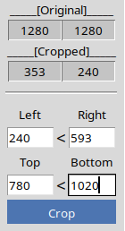
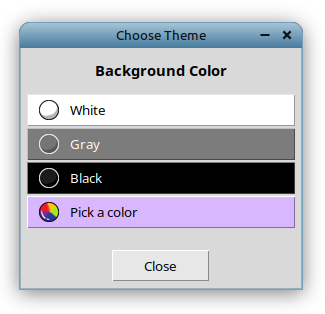
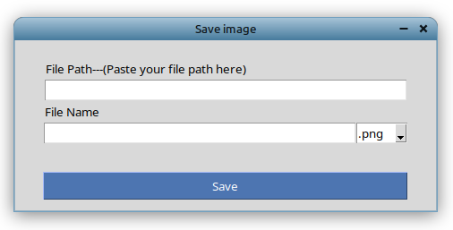
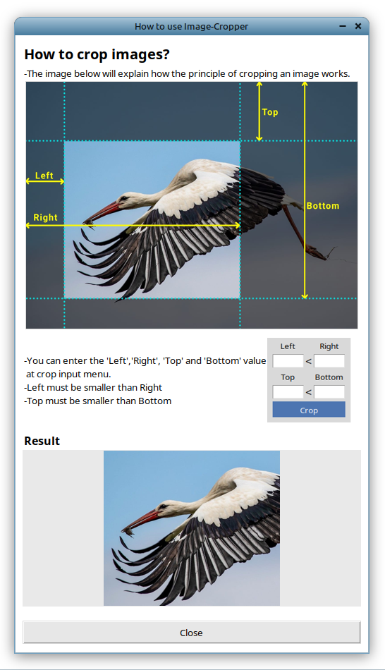
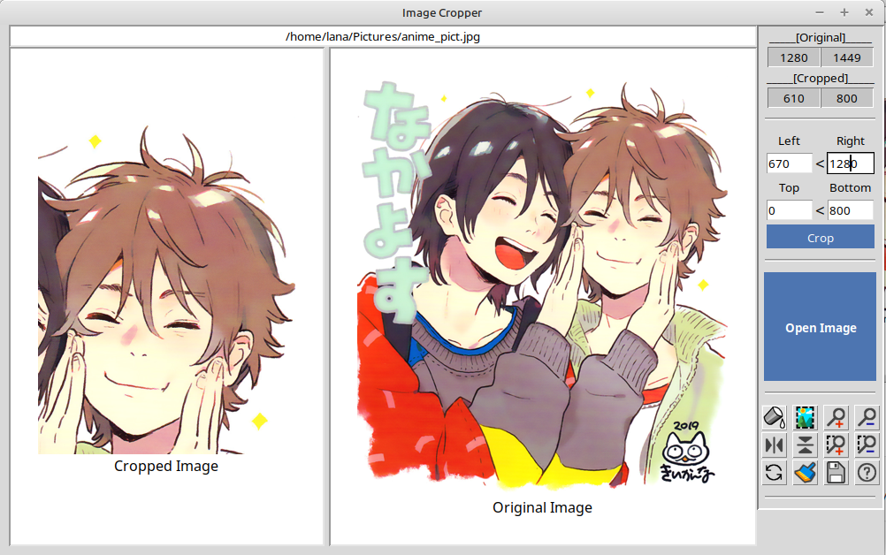
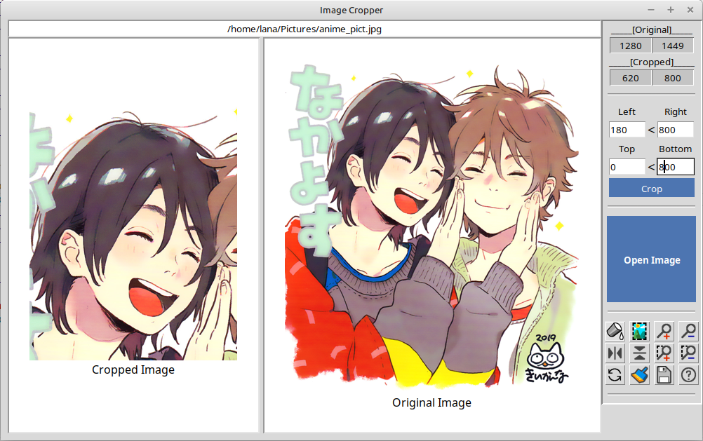

# Image-Cropper

A simple application made with Python, it works to crop images.

## Features Include:
- image cropping range input

- change background color

- show full image
- zoom in and out (original image, cropped image)
- flip verical and horizontal
- turn image
- clear image cropping range input
- save image

- how to use window

## Preview:

